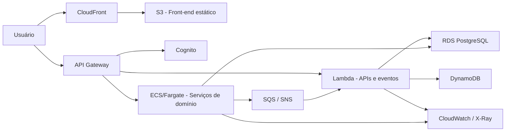

# Diagrama Final da Arquitetura

## Leitura do diagrama

- O front-end é distribuído via CDN e armazenado em objeto estático.
- O API Gateway centraliza o tráfego e a política de acesso.
- Cognito atua como serviço de identidade.
- Lambda cobre automações curtas, endpoints e eventos.
- ECS/Fargate cobre rotinas mais longas e serviços de domínio.
- RDS e DynamoDB formam a persistência híbrida.
- SQS/SNS suportam integração assíncrona.
- CloudWatch e X-Ray sustentam observabilidade e rastreamento.
