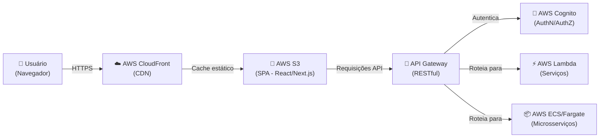
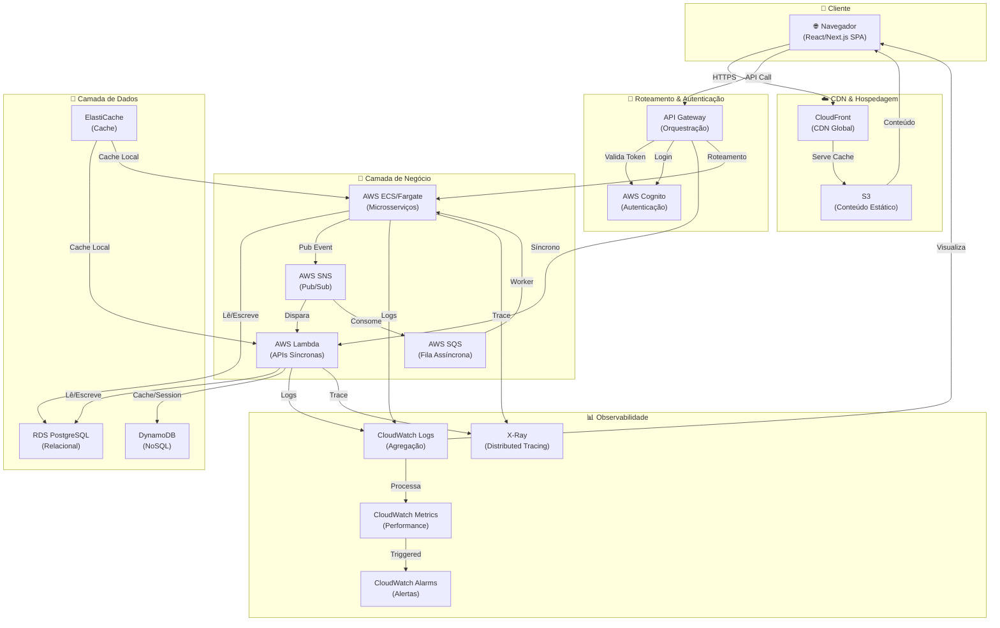
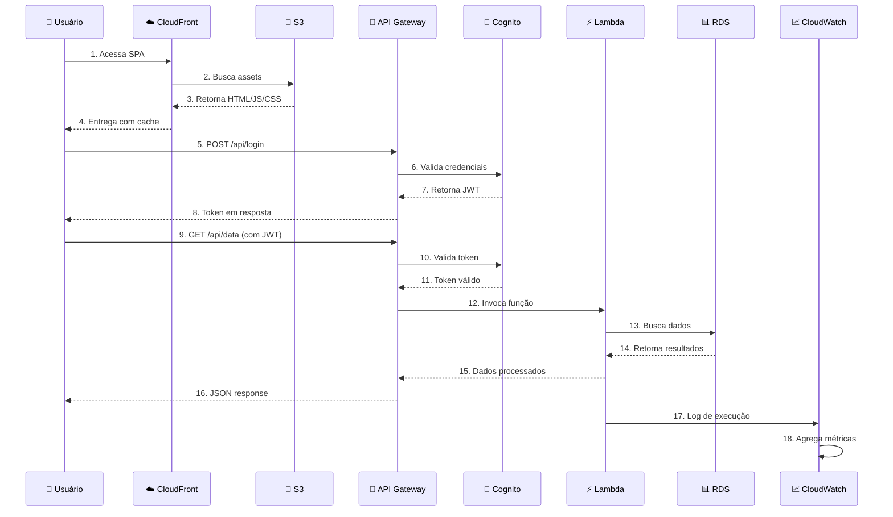
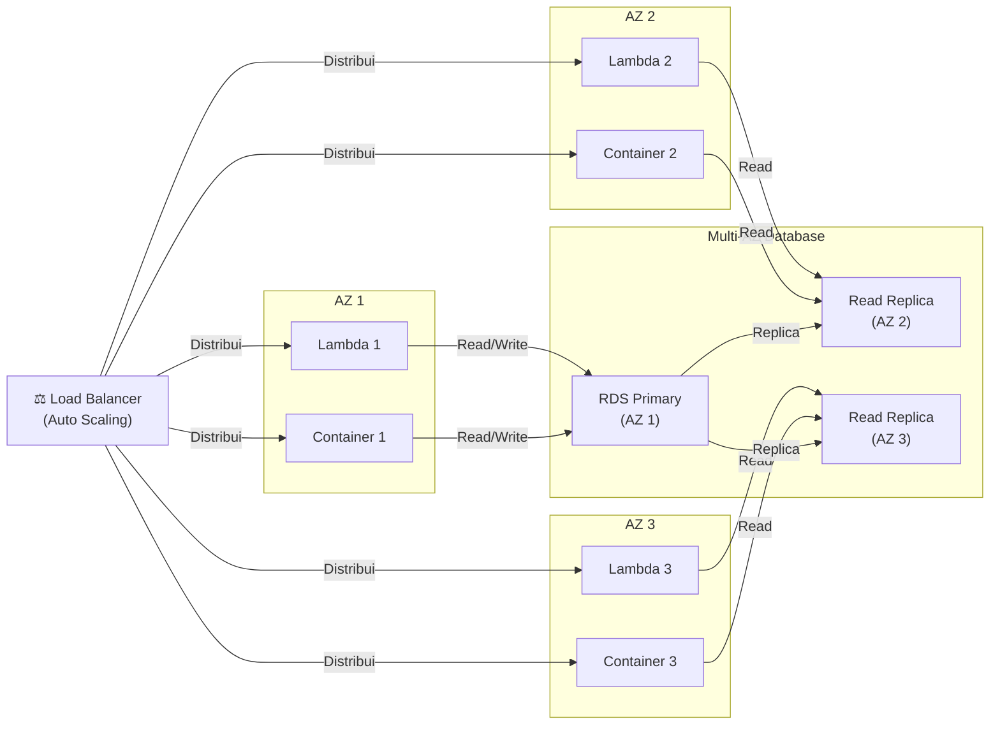
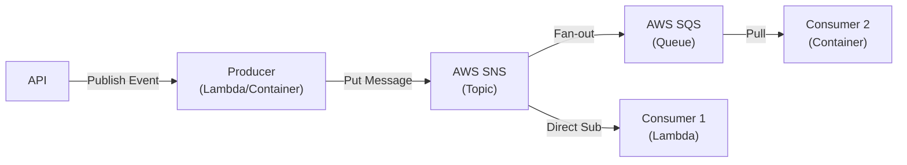
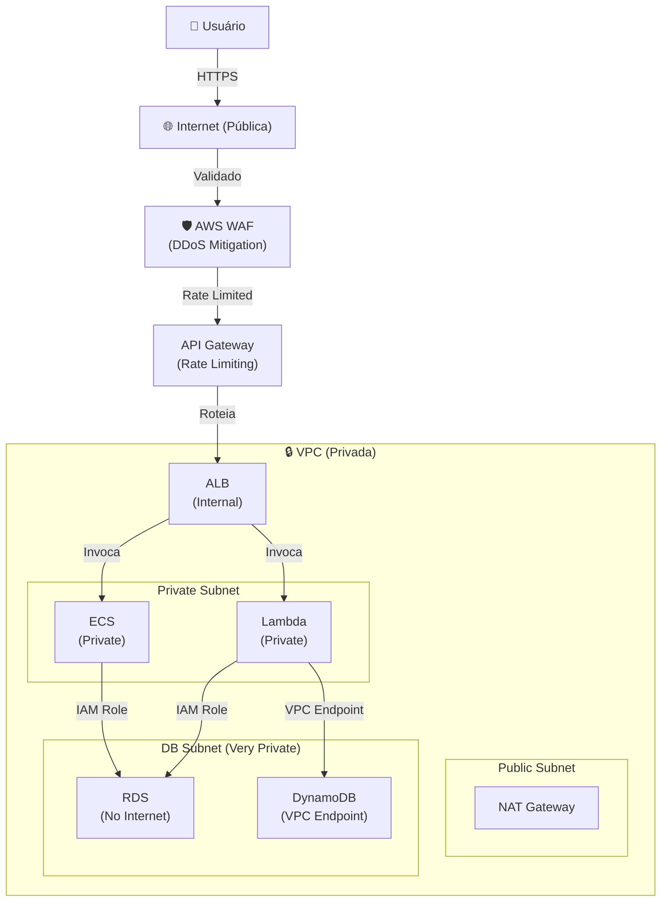
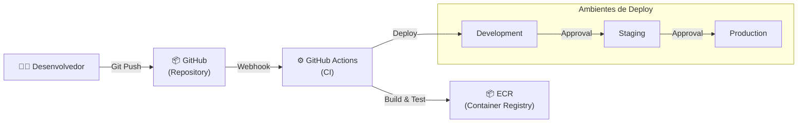

# Diagrama da Arquitetura — Formato Mermaid

## Nota
Este arquivo documenta o código Mermaid para visualizar a arquitetura. 
O diagrama pode ser visualizado em:
- [Mermaid Live Editor](https://mermaid.live)
- [Draw.io](https://draw.io)
- VS Code com extensão Markdown Preview Mermaid Support

---

## 1. Diagrama de Arquitetura — C4 Context Level

---

## 2. Diagrama Detalhado — C4 Container Level

---

## 3. Diagrama de Fluxo de Requisição

---

## 4. Diagrama de Escalabilidade

---

## 5. Diagrama de Comunicação Assíncrona

---

## 6. Diagrama de Segurança

---

## 7. Diagrama de CI/CD

---

## 8. Padrões de Consumo do Diagrama

Os diagramas acima podem ser:

1. **Copiados diretamente** para [Mermaid Live Editor](https://mermaid.live)
2. **Renderizados em VS Code** com a extensão `Markdown Preview Mermaid Support`
3. **Convertidos para PNG/SVG** usando ferramentas online ou CLI (`mmdc -i diagrama.mmd -o diagrama.png`)

---

**Gerado em:** Maio/2026 | **Versão:** 1.0
